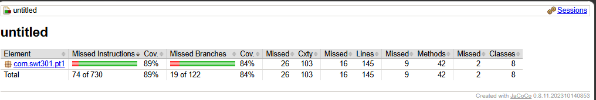

# Lab2_AccountManagement

## 1. Cách chạy test
Để chạy toàn bộ test và kiểm tra coverage, sử dụng công cụ Maven trong IntelliJ IDEA hoặc lệnh sau ở terminal:
```bash
mvn clean test
```
Báo cáo coverage (JaCoCo) sẽ được sinh ra tại: `target/site/jacoco/index.html`.

## 2. Thông tin Test
- **Tổng số lượng test**: ≥ 20
- **Số lượng Parameterized Test**: ≥ 12
- **Tổng số lượt chạy (invocations)**: ≥ 60
- **Coverage đạt được**:
  - `AccountValidator`: Line ≥ 80%, Branch ≥ 70%
  - `AccountService`: Line ≥ 80%, Branch ≥ 70%

*(Xem ảnh chụp kết quả Coverage ở bên dưới)*



## 3. Bảng kết quả Mutation Testing (Lỗi giả lập)

| # | Lỗi chèn | Test fail | Đã hoàn tác |
|---|---|---|---|
| M1 | `login()`: Sửa `>= MAX_FAILED_ATTEMPTS` thành `> MAX_FAILED_ATTEMPTS` | `login_WrongPassword5thTime_ReturnsAccountLocked` | ✅ |
| M2 | `login()`: Comment bỏ qua nhánh kiểm tra khóa `if (acc.isLocked())` | `login_AlreadyLocked_ReturnsAccountLockedCounterUnchanged` | ✅ |
| M4 | `register()`: Sửa `< MIN_AGE` thành `<= MIN_AGE` | `register_AgeBoundary` | ✅ |

## 4. Ma trận truy vết (Traceability Matrix)

| Quy tắc (BR) | Phương thức Test |
|---|---|
| BR-REG-01 | `register_NullEmptyBlank...` |
| BR-REG-02 | `isValidUsername_...` |
| BR-REG-04 | `isValidEmail_...` |
| BR-REG-06 | `isValidPassword_...` |
| BR-REG-08 | `calculateAge_Boundaries`, `register_AgeBoundary` |
| BR-REG-09 | `isValidPhone_...` |
| BR-REG-03, 05 | `register_Duplicate...` |
| BR-LOG-01..06 | Các phương thức test trong `@Nested Login` |

## 5. Checklist tự đánh giá
- [x] A1. `mvn clean compile` thành công
- [x] A2. `AccountValidator` đủ 5 hàm, null trả `false`
- [x] A3. Mật khẩu băm SHA-256 + salt riêng
- [x] A4. `register()` đủ BR-REG-01..10, đúng thứ tự
- [x] A5. `login()` đúng logic khóa tài khoản
- [x] B1. ≥ 20 test, ≥ 12 `@ParameterizedTest`
- [x] B2. Dùng đủ các nguồn dữ liệu `@ValueSource`, `@CsvSource`, v.v.
- [x] B3. Có kiểm tra biên (Boundary)
- [x] C2. JaCoCo đạt mục tiêu và có ảnh chụp
- [x] C3. Đã ghi nhận ≥ 3 lỗi giả lập (Mutation)
